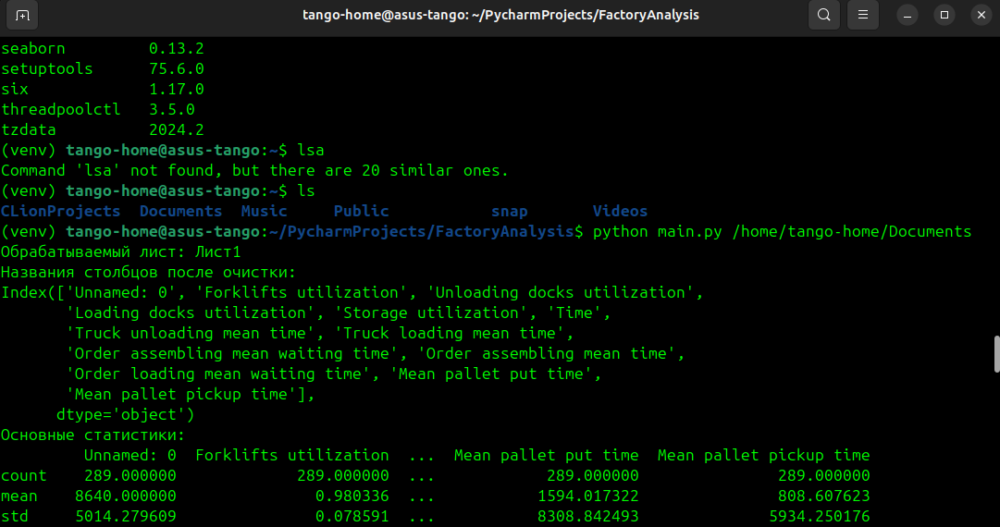
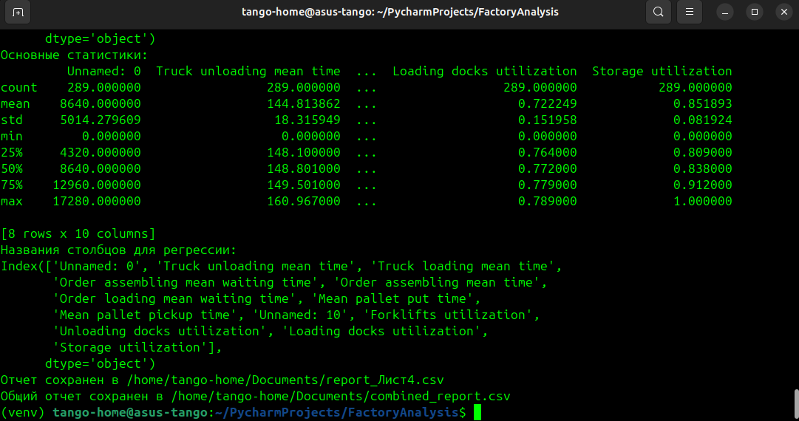
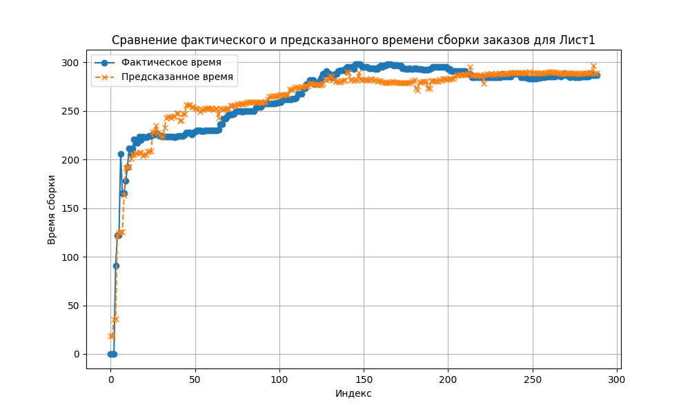
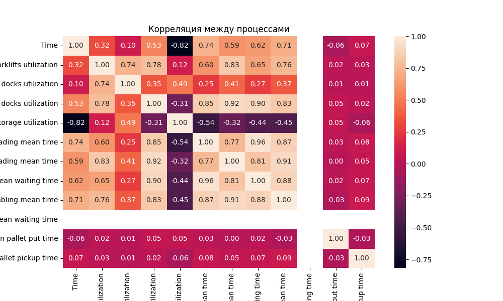

Factory Analysis
=========================================================================================================================================
### This repository is intended for the demonstration and submission of the exam for the course 'Technologies of Intelligent Computing'. 
#### It was completed by students of group 5011: Ivan Bulatnikov, Danila Pashkov, Matvey Klevtsov, Daniil Khvatov, Maxim Golubev."
#### Repository owner: Maxim Golubev, a.k.a SanchezRI, a.k.a campaigner1
_________________________________________________________________________________________________________________________________________
## Prerequirements
- Python => 3.12
- Data from Anilogic model (See /data/data_model.xlsx)
_________________________________________________________________________________________________________________________________________
## Installation
Check python's version and go to Project Directory

    bash
    python3 --version
    cd /path/to/your/project
    python3 -m venv venv
Start env for Linux-based systems:

    bash
    source venv/bin/activate
Start env for Windows:

    bash
    .\venv\Scripts\activate
Install required packets:

    bash
    pip install -r requirements.txt
_________________________________________________________________________________________________________________________________________
## Usage
    bash
    python main.py /output/directory/path
    
_________________________________________________________________________________________________________________________________________
## Screenshots of usage

_________________________________________________________________________________________________________________________________________
## Gallery
Predicted and actual time graphics. Correlation data from List1:

